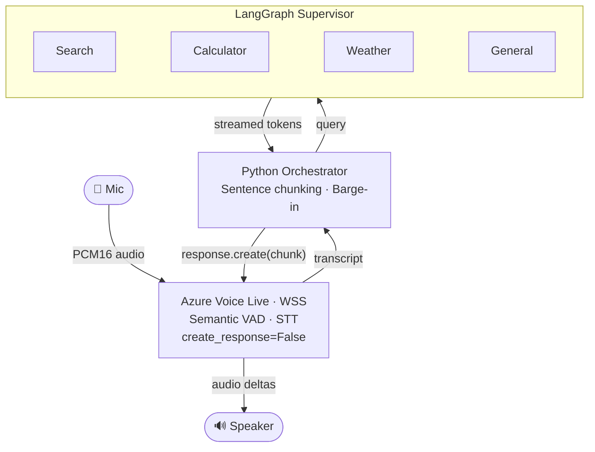

# Voice Bot Prototype: Azure Voice Live + LangGraph

This prototype shows how to add a voice interface to an **existing LangGraph text chatbot** while preserving end-to-end streaming. It intentionally bypasses Voice Live's built-in LLM and tool-calling layer — treating Voice Live as a **speech I/O channel only** — and uses a Python orchestrator to glue Voice Live STT output to LangGraph, streaming the response back as progressively synthesized audio. No public Azure sample demonstrates this `create_response=False` + semantic VAD + external reasoning pattern.

## Why NOT Voice Live Tool Calling for LangGraph

Voice Live natively supports tool/function calling: the built-in LLM invokes a declared function, your code runs it, and the result is returned. This works for simple, single-turn tool calls. It **breaks streaming** when the "tool" is an entire LangGraph pipeline:

1. **One-shot payload** — Voice Live sends a single JSON payload and waits for a single JSON result. You cannot stream partial results back while the tool runs.
2. **Multi-second latency** — a LangGraph supervisor that routes to sub-agents, invokes tools, and composes an answer can take several seconds. The user hears silence.
3. **No progressive TTS** — the tool result arrives as a single block, so Voice Live must synthesize the full response before playback begins, eliminating the streaming UX.
4. **Opaque topology** — the built-in LLM cannot act as a routing supervisor across multiple LangChain agents. You would need to flatten the graph into a set of Voice Live tools, losing the supervisor's reasoning and state management.

**Workaround implemented here:** bypass the Voice Live LLM/tool-calling layer entirely. Use Voice Live only for STT + VAD + TTS. Route transcribed text to LangGraph externally, stream tokens back, and progressively synthesize audio in sentence-sized chunks.

## Architecture

```text
            [ Mic ]
               |
               |  PCM16 audio
               v
+-----------------------------+
|   Azure Voice Live (WSS)    |
|-----------------------------|
|  Semantic VAD               |
|  STT (create_response=False)|
+--------------+--------------+
               |
               |  transcript
               v
    +---------------------+
    | Python Orchestrator  |
    |---------------------|
    | Sentence chunking    |
    | Barge-in control     |
    +----------+----------+
               |
               |  query
               v
    +---------------------+
    | LangGraph Supervisor |
    |---------------------|
    | Search  | Calculator |
    | Weather | General    |
    +----------+----------+
               |
               |  streamed tokens
               |  (chunked by Orchestrator)
               v
+-----------------------------+
|  Voice Live TTS             |
|-----------------------------|
|  response.create(chunk)     |
|  (same WSS connection)      |
+--------------+--------------+
               |
               |  audio deltas
               v
          [ Speaker ]
```



### Data Flow

1. **Mic** captures audio and streams PCM16 to Voice Live via WebSocket (`voice_live/audio.py:AudioManager.capture_mic_loop`).
2. **Voice Live** runs semantic VAD to detect end-of-turn, then transcribes speech. `create_response=False` prevents auto-LLM (`voice_live/session.py:_build_session_config`).
3. The **event dispatcher** fires `on_transcript`, and the **orchestrator** streams the text through the LangGraph supervisor, which delegates to the appropriate sub-agent (`voice_live/events.py:EventDispatcher.run`, `orchestrator.py:Orchestrator._handle_transcript`).
4. The **orchestrator** buffers streamed tokens, flushes at sentence boundaries (regex `[.!?;]\s`) or 200-char max, and sends each chunk to Voice Live via `response.create(instructions=chunk)` for progressive audio synthesis (`orchestrator.py:Orchestrator._flush_chunk`, `voice_live/session.py:trigger_tts`). Audio deltas stream to the speaker as each chunk is synthesized.
5. If the user speaks during playback (**barge-in**), the orchestrator cancels the server response, clears the audio queue, and starts a new turn (`orchestrator.py:Orchestrator._handle_barge_in`).

## Responsibility Split

Because the Voice Live LLM layer is bypassed (`create_response=False`), responsibilities shift to the orchestration layer and the glue code:

| Responsibility | Voice Live | Orchestrator / Glue | LangGraph |
|---|---|---|---|
| Audio capture (mic) | — | `audio.py:AudioManager` | — |
| VAD (turn detection) | Semantic VAD | — | — |
| STT (transcription) | `azure-speech` model | — | — |
| Reasoning / LLM | **Bypassed** | — | Supervisor + sub-agents |
| Tool routing | **Bypassed** | — | Supervisor conditional edges |
| Conversation memory | — | — | `InMemorySaver` (prototype) |
| Streaming UX policy | — | Sentence chunking | Token streaming (`astream_events`) |
| TTS synthesis | `response.create()` | Chunk gating + trigger | — |
| Audio playback (speaker) | — | `audio.py:AudioManager` | — |
| Barge-in handling | `speech_started` event | Cancel + clear + debounce | — |
| Error handling | WSS error events | `try/except` in pipeline | — |

## What Orchestration Must Own (Because the LLM Layer Is Bypassed)

### Conversation State and Memory

The orchestration layer owns all conversation state. This prototype uses LangGraph's `InMemorySaver` (`langgraph_agent/graph.py:memory`) with a hardcoded `thread_id` (`langgraph_agent/__init__.py:_GRAPH_CONFIG`). Production requires durable, per-session state (e.g., Cosmos DB checkpointer or Redis).

### Tool Routing and Supervisor Logic

The LangGraph supervisor (`langgraph_agent/graph.py:_supervisor`) classifies user messages and routes to specialist sub-agents. All tool definitions, routing rules, and agent composition are owned by the graph — Voice Live's `tools=[]` is explicitly empty (`voice_live/session.py:_build_session_config`).

### Streaming UX and TTS Chunking

The orchestrator decides when enough text has accumulated to trigger TTS (`orchestrator.py`):

- Flush at sentence boundaries (`.`, `!`, `?`, `;` followed by whitespace or end-of-string).
- Force-flush at 200 chars (`_MAX_CHUNK_CHARS`) to avoid long silences.
- Minimum 10 chars (`_MIN_CHUNK_CHARS`) to avoid choppy micro-chunks.
- Wait for each chunk's `RESPONSE_DONE` before sending the next (sequential gating via `_response_done` event).

TTS is driven by `response.create(instructions=chunk)` (`voice_live/session.py:trigger_tts`), which asks the Voice Live LLM to repeat the text verbatim. This is a workaround — Voice Live does not expose a pure TTS-only API on the same WebSocket. Fidelity is ~95%; see the Path A vs Path B comparison below for alternatives.

### Error Handling and Cancellation

- **Barge-in:** sets a barge-in event, increments the turn counter, cancels the server response (`conn.response.cancel()`), clears the output audio buffer, and cancels the in-flight transcript handler task (`orchestrator.py:Orchestrator._handle_barge_in`). A 1.5 s debounce window (`_BARGE_IN_DEBOUNCE_SECS`) prevents false triggers from echo.
- **Empty responses:** if LangGraph produces no output, the pipeline resets immediately without waiting for `RESPONSE_DONE`.
- **Expected errors:** `response_cancel_not_active` and `already_has_active_response` are logged at `DEBUG` level (`voice_live/events.py:EventDispatcher.run`).

## Architecture Decision: Path A vs Path B

This prototype uses **Path A** — a single Voice Live WebSocket for both STT and TTS:

| Aspect | Path A (This Prototype) | Path B (Production Alternative) |
|---|---|---|
| **TTS mechanism** | Voice Live `response.create(instructions=text)` | Azure Speech SDK text streaming |
| **Verbatim fidelity** | ~95% (model may paraphrase) | 100% guaranteed |
| **Connections** | Single WebSocket | Two (Voice Live + Speech SDK) |
| **Barge-in** | Native support | Manual implementation needed |
| **Cost** | Higher (LLM tokens for TTS) | Lower (Azure Neural TTS pricing) |
| **Latency** | Model inference per chunk | ~200-500 ms first byte with text streaming |
| **Complexity** | Low | Medium |

For production verbatim TTS, replace `response.create` with Azure Speech SDK text streaming (`SpeechSynthesisRequest(input_type=TextStream)` feeding LangGraph tokens progressively). This gives 100% fidelity, lower cost, and better latency, at the expense of managing a second connection and implementing barge-in manually.

## How to Run

### Prerequisites

- **Python 3.9+**
- **PortAudio** system library (for PyAudio):

  ```bash
  # Ubuntu/Debian
  sudo apt-get install portaudio19-dev libasound2-dev
  # macOS
  brew install portaudio
  ```

- **Azure OpenAI resource** with:
  - Voice Live model (e.g., `gpt-4o`) — fully managed, no deployment needed
  - `gpt-4o` deployment (for LangGraph agents via Azure OpenAI)
- **Microphone and speaker** (or headphones to avoid echo)

### Setup

```bash
# 1. Create and activate virtual environment
cd voice-bot-prototype
python3 -m venv venv
source venv/bin/activate

# 2. Install dependencies
pip install -r requirements.txt

# 3. Configure environment
cp .env.example .env
# Edit .env with your Azure credentials (see "Getting API Keys" below)
```

### Getting API Keys

```bash
# 1. Authenticate
az login

# 2. Retrieve key
az cognitiveservices account keys list \
  --name <RESOURCE_NAME> \
  --resource-group <RESOURCE_GROUP> \
  --query key1 -o tsv
```

<details>
<summary>Troubleshooting: disableLocalAuth is enabled</summary>

Azure AI Services resources provisioned through Microsoft Foundry may have local authentication disabled by default. Enable it with:

```bash
az rest --method patch \
  --url "https://management.azure.com/subscriptions/<SUB_ID>/resourceGroups/<RG>/providers/Microsoft.CognitiveServices/accounts/<NAME>?api-version=2024-10-01" \
  --body '{ "properties": { "disableLocalAuth": false } }'
```

Then retry the key retrieval command. The toggle may revert if an Azure Policy enforces it. For production, use Entra ID authentication.

</details>

### Required Environment Variables

| Variable | Description |
|---|---|
| `AZURE_VOICELIVE_ENDPOINT` | WSS endpoint for Voice Live (e.g., `wss://your-resource.openai.azure.com`) |
| `AZURE_VOICELIVE_API_KEY` | API key for the Voice Live resource |
| `AZURE_OPENAI_ENDPOINT` | HTTPS endpoint for Azure OpenAI (e.g., `https://your-resource.openai.azure.com/`) |
| `AZURE_OPENAI_API_KEY` | API key for Azure OpenAI |

Optional variables with defaults are documented in `.env.example`.

### Run

```bash
source venv/bin/activate
python main.py
```

Speak into your microphone. The bot will greet you on launch, detect when you stop speaking (semantic VAD), transcribe your speech, route to the appropriate LangGraph agent, and stream the response as progressively synthesized audio. All sessions are logged to `voicebot.log`. Press **Ctrl+C** to stop.

## Production Readiness Checklist

> This is a proof-of-concept. The items below are **not addressed** and must be resolved before production deployment.

### Security

| Item | Status | Guidance |
|---|---|---|
| Replace API keys with Entra ID / managed identity | Not started | Use `DefaultAzureCredential` for both Voice Live and Azure OpenAI connections (`config.py`) |
| Store secrets in Azure Key Vault | Not started | Remove plaintext keys from `.env`; reference Key Vault secrets at runtime |
| Add PII redaction to logs | Not started | Transcripts contain user speech — apply masking or disable transcript logging (`voicebot.log`) |
| Enforce log rotation and retention policy | Not started | `voicebot.log` grows unbounded; configure `RotatingFileHandler` with retention limits |
| Validate/sanitize transcribed text | Not started | Add length limits and content filtering before passing to LangGraph |
| Secure WSS connection | Partial | WSS is encrypted by default; evaluate mTLS or VNet integration for enterprise |

### Reliability

| Item | Status | Guidance |
|---|---|---|
| Auto-reconnect on WebSocket disconnect | Not started | Implement exponential backoff reconnect in `voice_live/session.py` |
| Add timeout to LangGraph agent calls | Not started | Wrap `stream_agent()` with `asyncio.wait_for()` and a configurable deadline |
| Retry transient failures (TTS trigger, audio buffer) | Not started | Add retry with backoff on `trigger_tts()` and `input_audio_buffer.append()` |
| Graceful degradation on agent failure | Not started | Speak a fallback message ("I'm having trouble, please try again") on exception |
| Idempotent transcript handling | Not started | Deduplicate repeated transcripts within a short window |

### Scale

| Item | Status | Guidance |
|---|---|---|
| Multi-session / multi-user support | Not started | Each session needs its own `VoiceLiveConnection`, `AudioManager`, and LangGraph `thread_id` |
| Connection pooling for Azure OpenAI | Not started | Share `AzureChatOpenAI` clients across sessions with proper concurrency limits |
| Quota-aware throttling | Not started | Monitor Azure OpenAI TPM/RPM and Voice Live concurrent session limits; implement backpressure |
| Load testing | Not started | Establish baseline: single-session latency p50/p95/p99 for STT, Agent, TTS stages |

### Observability

| Item | Status | Guidance |
|---|---|---|
| Per-stage latency metrics (STT / Agent / TTS) | Partial | `logger.py` has local timers; export to Application Insights or Prometheus |
| Distributed tracing with correlation IDs | Not started | Propagate a `turn_id` or `trace_id` across STT → LangGraph → TTS for end-to-end tracing |
| Structured logging (JSON) | Not started | Replace text format with JSON structured logging for log analytics ingestion |
| Health check / liveness probe | Not started | Required for container deployment; expose a simple HTTP endpoint |

### Cost

| Item | Status | Guidance |
|---|---|---|
| Token usage tracking per session | Not started | Log `completion_tokens` and `prompt_tokens` from LangGraph LLM calls |
| Audio-minute tracking | Not started | Track total audio duration sent to Voice Live per session |
| Budget alerts | Not started | Configure Azure Cost Management alerts on the OpenAI and Speech resources |
| Evaluate pure TTS vs LLM-based TTS cost | Not started | Current `response.create()` uses LLM tokens for TTS; consider Path B (Azure Speech TTS SDK) |

### UX

| Item | Status | Guidance |
|---|---|---|
| Tune VAD sensitivity per environment | Not started | `threshold`, `silence_duration_ms`, and `prefix_padding_ms` in `voice_live/session.py` need calibration per hardware |
| Tune barge-in debounce window | Not started | 1.5 s may be too aggressive; test with headphones vs. speakers |
| Validate TTS verbatim fidelity | Not started | Measure paraphrase rate; consider Path B if fidelity is insufficient |
| Optimize chunk size for naturalness | Not started | Test shorter/longer chunks; evaluate hybrid sentence + time-based flushing |

### Deployment

| Item | Status | Guidance |
|---|---|---|
| Containerize (Dockerfile) | Not started | Required for Azure Container Apps or App Service hosting |
| Add IaC (Bicep/Terraform) and CI/CD | Not started | No deployment artifacts exist; runs locally only |
| Replace stub tools with real APIs | Not started | `search_tool` and `weather_tool` return hardcoded data (`langgraph_agent/tools.py`) |
| Multi-language STT support | Not started | Currently `en-US` only; requires dynamic `AzureSemanticVad.languages` config |
| Browser-based audio clients | Not started | Uses local PyAudio; browser clients need WebRTC or server-side WebSocket relay |

## Key Learnings and Gotchas

### SDK discriminator fields: always set `type` explicitly

Azure Voice Live model classes use a `type` discriminator for polymorphic serialization, but not all classes auto-populate it (SDK v1.1.0). Notably, `AudioNoiseReduction()` without `type` serializes to `{}`, causing the service to reject the config and close the WebSocket after 5 retries. Always pass `type` explicitly (valid values: `"azure_deep_noise_suppression"`, `"near_field"`, `"far_field"`) and verify with `obj.as_dict()`.

### `astream_events` v2 for nested sub-agents

LangGraph's `astream(stream_mode="messages")` only captures LLM tokens from direct graph nodes. For supervisor patterns with `create_react_agent` sub-agents, use `graph.astream_events(version="v2")` and filter for `on_chat_model_stream` events. Skip the supervisor node's routing tokens (they emit one-word labels like "search") by checking `event.metadata.langgraph_node` (`langgraph_agent/__init__.py:stream_agent`).

## Project Structure

```text
voice-bot-prototype/
├── main.py               # Entry point: logging, lifecycle, signal handling
├── orchestrator.py        # Core pipeline: STT → LangGraph → TTS
├── config.py              # Environment variable loading
├── logger.py              # Structured stage-level logging with latency tracking
├── requirements.txt       # Python dependencies
├── .env.example           # Environment variable template
├── voice_live/
│   ├── __init__.py        # Package exports (create_session, trigger_tts)
│   ├── session.py         # Voice Live session setup (create_response=False)
│   ├── audio.py           # PyAudio mic capture + speaker playback
│   └── events.py          # Server event dispatcher with callbacks
└── langgraph_agent/
    ├── __init__.py         # Public API (stream_agent, invoke_agent)
    ├── graph.py            # Supervisor StateGraph + sub-agent routing
    └── tools.py            # Sample tools (search, calculator, weather stubs)
```

## Roadmap / Next Steps

1. **Replace stub tools** with real integrations (Azure AI Search, OpenWeatherMap) to validate end-to-end latency with production backends.
2. **Add Entra ID authentication** and Key Vault secret management to eliminate plaintext API keys.
3. **Implement WebSocket reconnect** with exponential backoff for session resilience.
4. **Add per-stage telemetry** (Application Insights) with correlation IDs for STT → Agent → TTS tracing.
5. **Evaluate Path B** (Azure Speech TTS SDK) for lower cost and guaranteed verbatim fidelity.
6. **Containerize** (Dockerfile) and add deployment artifacts (Bicep/Terraform, CI/CD) for Azure Container Apps or App Service.
7. **Load-test** single-session latency and document concurrency limits against Voice Live and Azure OpenAI quotas.
8. **Tune VAD and barge-in parameters** across target hardware (headphones, speakerphone, conference room).

## References

| Resource | What it covers |
|---|---|
| [Azure OpenAI Realtime Audio Reference](https://learn.microsoft.com/azure/ai-services/openai/realtime-audio-reference) | Full event catalog, `RealtimeTurnDetection` schema including `create_response` boolean, `response.create` event structure |
| [How to use the Realtime API](https://learn.microsoft.com/azure/ai-services/openai/how-to/realtime-audio) | "VAD without automatic response generation" section with JSON example of `create_response: false` |
| [Azure Voice Live API Overview](https://learn.microsoft.com/azure/ai-services/openai/concepts/voice-live-api) | Managed speech-to-speech layer, supported models (gpt-realtime, gpt-4o, gpt-4.1, gpt-5, phi4), noise suppression, echo cancellation, advanced end-of-turn detection |
| [AzureSemanticVad Python SDK Reference](https://learn.microsoft.com/python/api/azure-ai-voicelive/azure.ai.voicelive.models.azuresemanticvad) | SDK class docs: `create_response`, `interrupt_response`, `threshold`, `silence_duration_ms`, `prefix_padding_ms`, `eagerness`, `languages`, `remove_filler_words` |
| [OpenAI Realtime API Guide](https://platform.openai.com/docs/guides/realtime) | Upstream OpenAI docs for the Realtime API protocol that Azure Voice Live is compatible with |

### Related Samples

| Sample | Pattern | How it differs from this prototype |
|---|---|---|
| [VoiceRAG (aisearch-openai-rag-audio)](https://github.com/Azure-Samples/aisearch-openai-rag-audio) | Middle-tier WebSocket proxy that intercepts tool calls server-side and injects RAG results | Uses `create_response=True` (default). The realtime model still does all reasoning; the middle tier just handles tool execution. |
| [aoai-realtime-audio-sdk](https://github.com/Azure-Samples/aoai-realtime-audio-sdk) | Official Python/JS SDK samples for the Realtime Audio API | Demonstrates `NoTurnDetection()` for push-to-talk and `ServerVAD` for auto-detection, but no sample sets `create_response=False` with VAD. |
| [azure-ai-voice-live-samples](https://github.com/Azure-Samples/azure-ai-voice-live-samples) | Voice Live SDK quickstarts and feature demos | Showcases Voice Live features (noise suppression, echo cancellation, semantic VAD) with default auto-response behavior. |
